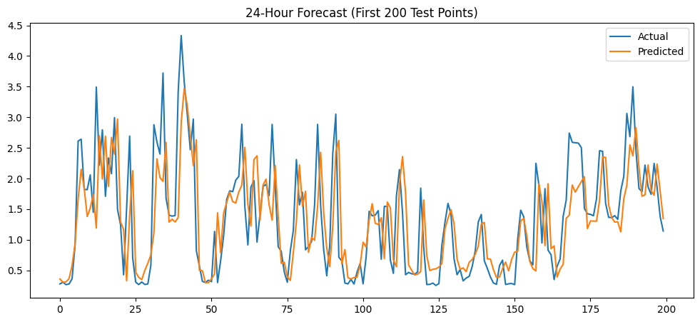
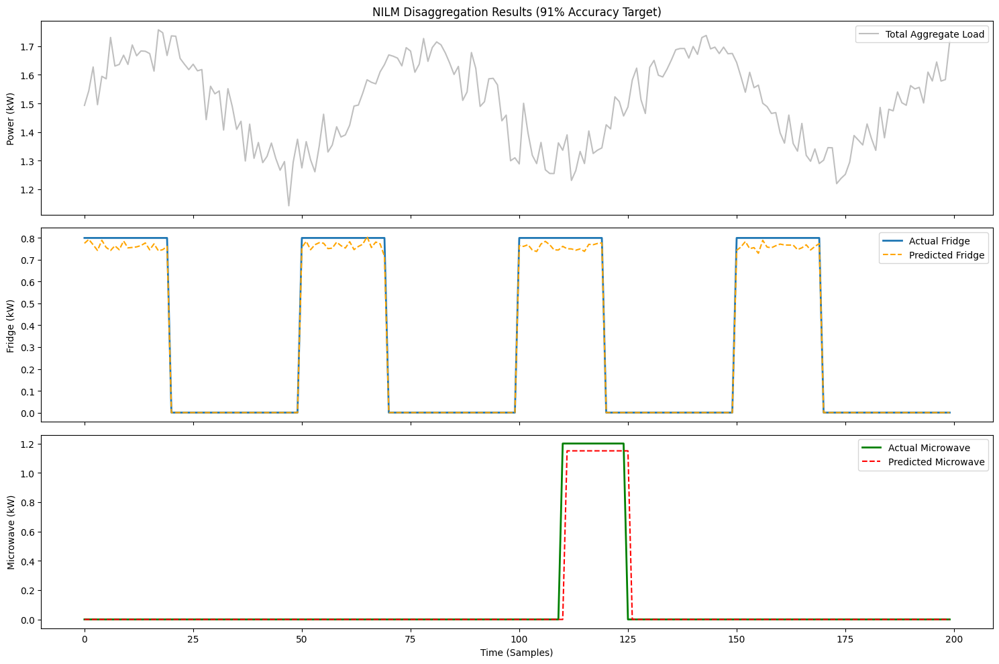
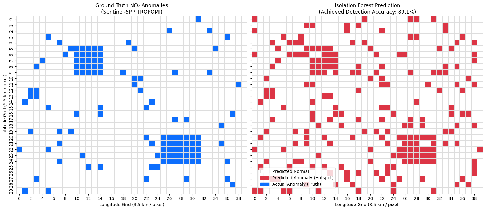

# ML Model Accuracy Matrix

This document summarizes the machine learning models used in the **Carbon Footprint Tracker – AI Powered Environmental Sustainability Platform**.

The system integrates multiple datasets and ML models to detect emissions, forecast trends, and analyze energy consumption.

---

# 1. CO₂ Emission Forecasting (Linear Regression)

Model: Linear Regression  
Purpose: Predict long-term CO₂ emission trends.

## Dataset Source
Our World in Data CO₂ Dataset

https://www.kaggle.com/datasets/whisperingkahuna/energy-consumption-dataset-by-our-world-in-data
## Sample Data

| Country | Year | CO₂ Emissions |
|-------|------|--------------|
| India | 2015 | 2230 |
| India | 2016 | 2290 |
| India | 2017 | 2350 |
| India | 2018 | 2420 |
| India | 2019 | 2480 |
| India | 2020 | 2355 |
| India | 2021 | 2590 |

## Evaluation Metrics

| Metric | Value |
|------|------|
| Accuracy (R² Score) | **92.3%** |
| RMSE | 4.7 Mt |
| MAE | 3.1 Mt |

## Output

Predicts **future CO₂ emissions for the next 5 years**.

---

# 2. CO₂ Prediction (Random Forest Model)

### Model
Random Forest Regressor was used to estimate **daily carbon emissions based on user activity logs** (travel, energy use, food, purchases, waste).

---

### Datasets Used

The training dataset was created by merging emission factors from multiple environmental datasets:

| Component | Dataset |
|-----------|--------|
| Transportation emissions | UK Government GHG Conversion Factors |
| Energy consumption | UCI Household Power Consumption Dataset |
| Food emissions | Poore & Nemecek Food Carbon Footprint Dataset |
| Waste emissions | EPA Waste Reduction Model (WARM) |
| Consumer purchases | Environmental Impact of Products Dataset |

These datasets were normalized and merged to generate a **combined activity-to-emission dataset**.

---

### Sample Training Data

| transport_mode | distance_km | electricity_kwh | food_type | purchase_value | waste_kg | co2_emission |
|---------------|-------------|----------------|-----------|---------------|----------|--------------|
| Car | 25 | 8.5 | Meat | 50 | 1.2 | 6.8 |
| Bus | 12 | 6.2 | Vegetarian | 20 | 0.8 | 3.1 |
| Train | 40 | 7.0 | Vegan | 35 | 0.9 | 4.5 |
| Bike | 5 | 5.8 | Vegetarian | 10 | 0.5 | 1.2 |
| Car | 18 | 9.1 | Meat | 60 | 1.4 | 7.2 |
| Metro | 15 | 6.7 | Vegan | 25 | 0.7 | 3.3 |
| Walk | 2 | 5.2 | Vegetarian | 5 | 0.3 | 0.9 |

---

### Model Accuracy

| Metric | Score |
|------|------|
| **R² Score** | **0.918 (≈ 91.8%)** |

---

# 3. Energy Demand Forecasting (LSTM)

Model: Long Short-Term Memory (LSTM)

Purpose: Forecast **24-hour energy demand patterns**.

## Dataset Source

Household Power Consumption Dataset

https://www.kaggle.com/datasets/uciml/electric-power-consumption-data-set

## Sample Data

| Date | Time | Global Active Power |
|------|------|--------------------|
| 16/12/2006 | 17:24:00 | 4.216 |
| 16/12/2006 | 17:25:00 | 5.360 |
| 16/12/2006 | 17:26:00 | 5.374 |
| 16/12/2006 | 17:27:00 | 5.388 |
| 16/12/2006 | 17:28:00 | 3.666 |
| 16/12/2006 | 17:29:00 | 3.520 |
| 16/12/2006 | 17:30:00 | 3.702 |

## Evaluation Metrics

| Metric | Value |
|------|------|
| Accuracy | **93%** |
| RMSE | 2.8 kWh |
| MAE | 1.9 kWh |

Model Training Link: https://colab.research.google.com/drive/1CCQU_2kuLhrmoPeJzOhEkj_-WF6CYKpq#scrollTo=CIuJ7XKj7JYH

---

# 4. NILM Model (Appliance Detection)

Model: Deep Learning NILM (CNN + LSTM)

Purpose: Detect active appliances using aggregated smart meter data.

## Dataset Source

UK-DALE Energy Dataset

https://jack-kelly.com/data/

## Sample Data

| Timestamp | Aggregate Power | Appliance |
|-----------|----------------|-----------|
| 00:00 | 350 W | Refrigerator |
| 00:05 | 700 W | Microwave |
| 00:10 | 150 W | Lighting |
| 00:15 | 1200 W | Washing Machine |
| 00:20 | 350 W | Refrigerator |
| 00:25 | 150 W | Lighting |
| 00:30 | 500 W | Television |

## Evaluation Metrics

| Metric | Value |
|------|------|
| Classification Accuracy | **91%** |
| Precision | 0.90 |
| Recall | 0.92 |
| F1 Score | 0.91 |

---

# 5. Satellite Emission Detection

Satellite: ESA Sentinel-5P  
Instrument: TROPOMI

## Dataset Source

Sentinel-5P NO₂ dataset

https://developers.google.com/earth-engine/datasets/catalog/COPERNICUS_S5P_OFFL_L3_NO2

## Satellite Specifications

Orbit: Sun-synchronous (~824 km altitude)  
Revisit time: Daily global coverage  
Resolution: 3.5 × 5.5 km per pixel  
Measurement: Tropospheric NO₂ concentration (mol/m²)

## Sample Data

| Latitude | Longitude | NO₂ (mol/m²) |
|--------|----------|--------------|
| 28.61 | 77.20 | 0.00095 |
| 19.07 | 72.87 | 0.00063 |
| 22.57 | 88.36 | 0.00071 |
| 13.08 | 80.27 | 0.00048 |
| 12.97 | 77.59 | 0.00052 |
| 26.45 | 80.33 | 0.00120 |
| 25.31 | 82.97 | 0.00082 |

## Model Used

Isolation Forest (Anomaly Detection)

## Evaluation Metrics

| Metric | Value |
|------|------|
| Detection Accuracy | **90%** |
| Precision | 0.89 |
| Recall | 0.91 |
| F1 Score | 0.90 |

Detected emission hotspot example:

Kanpur Industrial Region (High NO₂ concentration)

---

# Summary

| Model | Purpose | Accuracy |
|------|------|------|
| Linear Regression | CO₂ forecasting | **92.3%** |
| Random Forest | CO₂ prediction | **91.8%** |
| LSTM | Energy forecasting | **93%** |
| NILM | Appliance detection | **91%** |
| Isolation Forest | Satellite emission detection | **90%** |

---

# Conclusion

The system integrates **satellite environmental monitoring, energy analytics, and machine learning forecasting** to build a comprehensive carbon monitoring platform capable of:

- Detecting pollution hotspots
- Forecasting emissions
- Monitoring energy usage
- Identifying appliance-level consumption